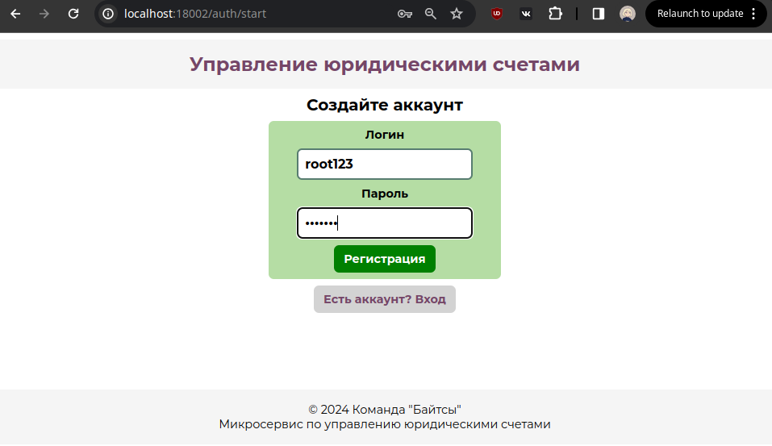
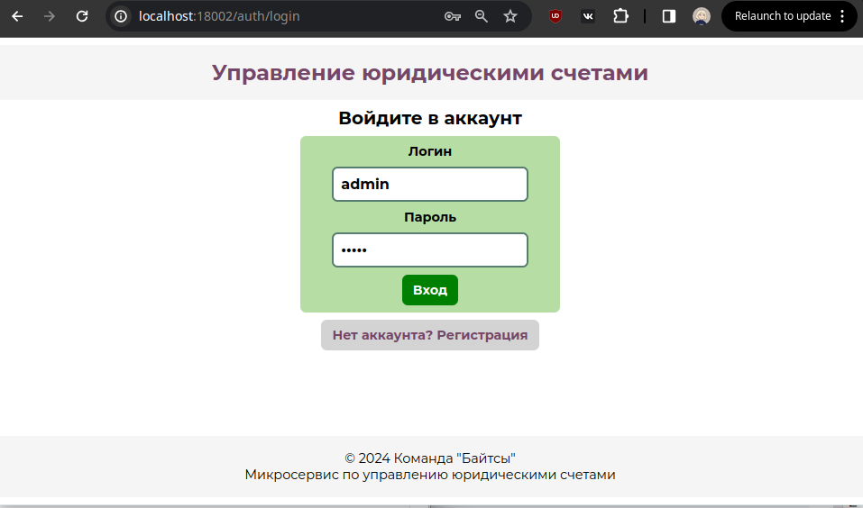
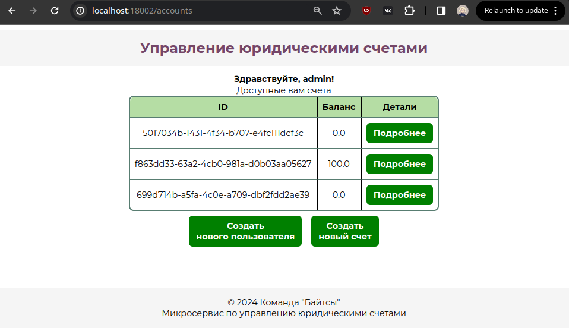
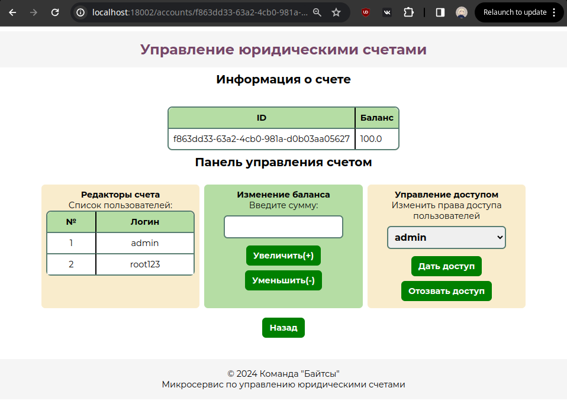

## <a id="description">Описание</a>

Это движок микросервиса с собственной базой данных для контроля баланса на счету юридического лица.

Счётом могут пользоваться много независимых внешних клиентов. По этой причине изменение баланса счета может происходить одновременно по нескольким независимым запросам.

## Использованные технологии

**Язык** - Java 21

**Фреймворки**:

* Spring Boot 3.2.4
* Spring Data
* Spring Security
* Swagger
* Docker
* Thymeleaf
* JUnit
* Mockito

**Автоматизация сборки** – Maven

**База данных** - H2

In-memory база данных H2 хранит данные в оперативной памяти, что ускоряет их обработку.

Операции с данными соответствуют ACID принципам благодаря транзакционному управлению Spring Data.

Spring Security вводит ограничения безопасности HTTP Basic Auth.

## Результат работы

### Немного о работе приложения:

Балансы счетов хранятся в базе данных в виде минорных единиц (копеек).

Сохраняется история изменения баланса для каждого счёта

### Выполненные пункты из условия:

* [x] [Сделан **UI** на основе **Thymeleaf** ](#ui)
* [x] Реализована и проверена **устойчивость** логики списания и начисления баланса к **параллельным запросам**
* [x] API приложения соответствует **конвенции REST API**
* [x] Покрытие автотестами >= 70%
* [x] Реализована авторизация через Spring Security
* [x] [Представлено описание проекта в README.md](#description)
* [x] Код проекта соответствует Java-конвенции
* [x] [Имеется описание API в Swagger](#swagger)
* [x] [Имеется Docker для удобного развёртывания приложения](#docker)
*

# Инструкция по запуску и эксплуатации проекта

## Сборка проекта

## <a id="docker">Docker</a>

Для начала вам надо будет загрузить образ из DockerHub:
```shell
docker pull torichan373/hackathon-be-coder-2024:latest
```

После можно запускать проект:
```shell
docker run -p 18002:18002 torichan373/hackathon-be-coder-2024:latest
```
Будет создан докер контейнер, который запуститься на порту 18002.

Чтобы остановить контейнер введите для эту команду, чтобы узнать id контейнера:
```shell
docker ps
```

Вы увидите строку подобного вида:
```
CONTAINER ID   IMAGE                                        COMMAND                CREATED         STATUS         PORTS                      NAMES
3ee259d886dc   torichan373/hackathon-be-coder-2024:latest   "java -jar /app.jar"   3 minutes ago   Up 5 seconds   0.0.0.0:18002->18002/tcp   stoic_pan
```

Чтобы остановить контейнер, введите эту команду:
```shell
docker stop 3ee259d886dc
```
Здесь id контейнера взят из промера выше, у вас будет другой id.

### С помощью Git

**Клонируйте к себе репозиторий с исходным кодом проекта**

```shell
git clone https://github.com/stepagin/hackathon-be-coder-2024
```
Перейдите в директорию проекта

```shell
cd hackathon-be-coder-2024
```

**Соберите jar файл**:

На Linux:

```shell
mvn clean package
```

На Windows:
```shell
.\mvnw clean package --% -Dmaven.test.skip=true
```

**Файл появится в папке target и его можно будет запустить**:

```shell
cd target
java -jar be-coder-1.0.jar 
```

## <a id="swagger">Swagger</a>

**Приложение запустится на порту 18002, его можно изменить в ``application.properties``**

<h3>Запросы для работы с приложением</h3>


Приложение защищено HTTP Basic Auth, для работы необходимо передавать логин и пароль пользователя в заголовке каждого запроса, кроме:

* создания нового пользователя (регистрации)
* просмотра состояния базы данных H2


### <a id="swagger">Посмотреть документацию в **Swagger UI** можно по ссылке (необходимо, чтобы приложение было запущено):</a>
```http request
http://localhost:18002/swagger-ui.html
```


## <a id="ui">User Interface</a>

В рамках пользовательского интерфейса реализованы 4 web-страницы. UI было протестировано в браузерах Firefox и Chrome.

Зарегистрировать нового пользователя можно на странице:

```
http://localhost:18002/auth/start
```

Необходимо указать логин и пароль.


Войти в уже существующий аккаунт можно на странице

```
http://localhost:18002/auth/login
```



Просмотреть доступные данному пользователю юридические счета можно на странице

```
http://localhost:18002/accounts
```

При нажатии кнопки "подробнее" можно перейти к странице конкретного аккаунта



Изменить баланс выбранного юридического счета и выдать либо отозвать права у других пользователей на его редактирование

```
http://localhost:18002/accounts/{accountId}
```



## Просмотр состояния базы данных

Перейдите по url:
```
http://localhost:18002/h2-console/
```
В открывшуюся форму необходимо ввести следующие данные
JDBC URL: ``jdbc:h2:mem:becoder``

Пользователь: ``root``

Пароль: ``root``

В открывшемся окне можно выполнять sql запросы.

Данные для подключения к БД можно изменить в файле application.properties


